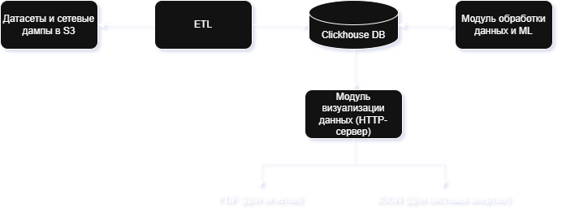

# RPRoject-ng

ETL-пайплайн на R для обработки сетевого трафика (CaptIPPER JSON-дампов) из S3
и загрузки нормализованных данных в ClickHouse.

### Архитектура проекта:


[Презентация](./doc/Архитектура.pptx)

Поток данных: S3 (JSON-дамп CaptIPPER) → парсинг (`info`, `client`, `flow_tree`,
`conversations`) → нормализация типов → запись в ClickHouse.

## Структура репозитория

```
RPRoject-ng/
├─ doc/                          # Архитектура и презентация
│  ├─ arch.png
│  └─ Архитектура.pptx
└─ r-etl/                        # ETL-пайплайн на R
   ├─ docker-compose.yml         # ClickHouse + ETL-сервис
   ├─ docker/Dockerfile.etl      # Образ rocker/tidyverse:4.3.2 + R-пакеты
   └─ R/
      ├─ main.R                  # Точка входа: оркестрация пайплайна
      ├─ s3_io.R                 # Скачивание JSON по HTTP/S3 URL
      ├─ parsing.R               # Парсинг CaptIPPER JSON
      ├─ normalization.R         # Нормализация типов и значений
      ├─ clickhouse_io.R         # DDL и вставка в ClickHouse
      └─ utils.R                 # Логирование и хелперы
```

## Быстрый старт

Требуется Docker и Docker Compose.

```bash
cd r-etl
cp .env.example .env             # заполнить креды S3 / ClickHouse
docker-compose up -d --build     # поднимаем ClickHouse и собираем ETL
docker-compose run etl           # запускаем пайплайн
```

Запуск с явными параметрами S3:

```bash
docker-compose run etl Rscript /app/R/main.R <s3_bucket_url> <item_name>
```

Подробности по локальному запуску, тестам и пересборке — в
[r-etl/README.md](./r-etl/README.md).

## Целевые таблицы ClickHouse

| Таблица                  | Содержимое                                                    |
|--------------------------|---------------------------------------------------------------|
| `dataset_info`           | Метаданные дампа (pcap_file, версия, время анализа)           |
| `client_attributes`      | HTTP-атрибуты клиента (User-Agent, Accept и т.п.)             |
| `flow_edges`             | Рёбра дерева потоков (parent → child, depth, path)            |
| `conversation_artifacts` | Артефакты HTTP (URI, заголовки, тело, хеши, magic, peinfo)    |

### DDL

Источник истины — [r-etl/R/clickhouse_io.R](./r-etl/R/clickhouse_io.R), таблицы
создаются автоматически на старте пайплайна (`CREATE TABLE IF NOT EXISTS`).

```sql
CREATE TABLE IF NOT EXISTS dataset_info (
  pcap_file         String,
  analysis_time     DateTime,
  captipper_version String,
  traffic_time      DateTime
) ENGINE = MergeTree()
ORDER BY (pcap_file);

CREATE TABLE IF NOT EXISTS client_attributes (
  attribute_name  String,
  attribute_value String
) ENGINE = MergeTree()
ORDER BY (attribute_name);

CREATE TABLE IF NOT EXISTS flow_edges (
  parent_name String,
  child_name  String,
  depth       UInt32,
  root_name   String,
  path        String
) ENGINE = MergeTree()
ORDER BY (parent_name, child_name);

CREATE TABLE IF NOT EXISTS conversation_artifacts (
  conversation_idx        UInt32,
  uri_idx                 UInt32,
  conversation_name       String,
  conversation_ip_raw     String,
  conversation_host       String,
  conversation_port       Nullable(UInt16),
  artifact_id             Nullable(UInt32),
  event_time_raw          String,
  event_time_parsed       Nullable(DateTime),
  host                    String,
  server_ip_raw           String,
  server_host             String,
  server_port             Nullable(UInt16),
  uri                     String,
  short_uri               String,
  method                  String,
  filename                String,
  referer                 String,
  request_headers_raw     String,
  response_headers_raw    String,
  response_status_raw     String,
  response_status_code    Nullable(UInt16),
  response_content_type   String,
  response_length_raw     String,
  response_length_bytes   Nullable(UInt64),
  response_body_raw       String,
  response_body_base64    String,
  response_peek           String,
  md5                     String,
  sha256                  String,
  magic_ext               String,
  magic_name              String,
  is_binary               Nullable(UInt8),
  is_executable           Nullable(UInt8),
  hexpeek                 String,
  peinfo_raw              String
) ENGINE = MergeTree()
ORDER BY (conversation_idx, uri_idx);
```

## Конфигурация (env)

Поддерживаются как новые `AWS_*`, так и легаси `S3_*` имена переменных
(см. [r-etl/R/s3_io.R](./r-etl/R/s3_io.R)).

- **S3:** `S3_ENDPOINT_URL`, `S3_BUCKET`, `S3_PREFIX`, `AWS_ACCESS_KEY_ID`,
  `AWS_SECRET_ACCESS_KEY`, `AWS_DEFAULT_REGION`
- **ClickHouse:** `CLICKHOUSE_HOST`, `CLICKHOUSE_PORT`, `CLICKHOUSE_USER`,
  `CLICKHOUSE_PASSWORD`, `CLICKHOUSE_DATABASE`
- **Прочее:** `LOG_LEVEL` (по умолчанию `INFO`), `TZ` (по умолчанию `UTC`)

Если `S3_PREFIX` не задан, имя файла берётся из последнего сегмента
`S3_ENDPOINT_URL`, иначе используется `dump.json`.
